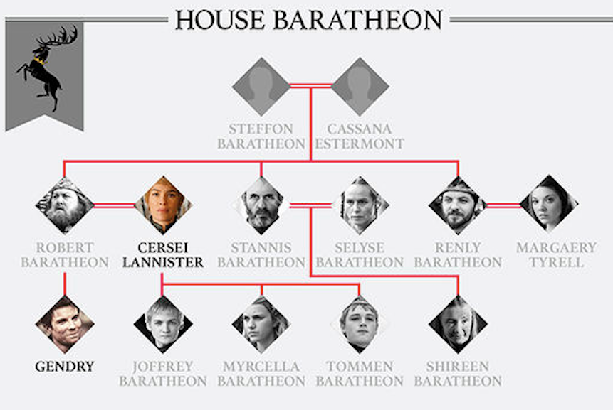

# Family Tree Traverse App - Any Family (Game of Thrones & Duck Looney Tunes) tested

Here a Project ScreenCast of the App about Usage: [YouTube ScreenCast Application](https://youtu.be/Uo_C_LJLYE0)

<!-- TOC depthFrom:2 depthTo:6 withLinks:1 updateOnSave:1 orderedList:0 -->

- [Description](#description)
- [Download](#download)
- [App Options](#app_options)
- [Usage](#usage)

<!-- /TOC -->

## Description

```
Develop a JAVA application that reads, edits, searches, and visualizes family trees or graphs. Assume that the names of the persons are all different from each other and therefore can be used as unique identifiers.
1. First encode the tree into a csv file (see below for example) (10 credits)
Then your application should meet the following requirements:
2. Read the file and load the data into a suitable data structure in your computer's main memory (10 units).
3. Classify people in lexical order and write a line for each one in a text file (10 credits)
4. Accepts as input two names and finds the relationship between them (45 points):
a. Father, mother, son and daughter. If the gender is not specified, use the parent / child relationship
b. Brother and sister. If the gender is not specified use the sibling relationship
c. The husband, or spouse, partner
d. They are not related
5. Save the data in DOT format so that it can be visualized by GraphViz ((5 units by DOT, 10 by GraphViz))
6. Create a text interface (a system of text menus) to implement all the previous steps (10 units).

The family tree you will be working with is from the Duck family as shown in the image below. In case a name is not known and appears in the image as ***, choose a name for yourself. Of course, do not forget that it should be unique
```




## Download

[Download Binaries Jar file](https://github.com/JotunMichael/Data-Structures-Algorithms/releases/tag/v0.1)

## App_Options

```bash
Option 1 to read the family members lists
Option 2 to create an alphabetically minimal sorted family members lists
Option 5 to create a Full output sorted Family memberss
Option 3 to use the relationship apps
Option 4 to generate the .dot file + Generate SVG GraphViz Images
```

## Usage

Use the below commands in the Command Prompt or any Terminal.

**Run App with or without Args**

*Note: This requires JRE/JDK 16.0.2*\
*Note: If no args passed program will catch from the latest input if given*\
*Note: App Supports Relative or Absolute Path Tracing*

```
java -jar familytreeapp.jar
java -jar familytreeapp.jar -p c:\path\to\family_duck.csv
java -jar familytreeapp.jar -p family_got.csv
java -jar familytreeapp.jar -p c:\path\to\family_duck.csv -l duck -o 5
java -jar familytreeapp.jar -p c:\path\to\family_duck.csv -l duck -o 3 Name1 Name2
```
